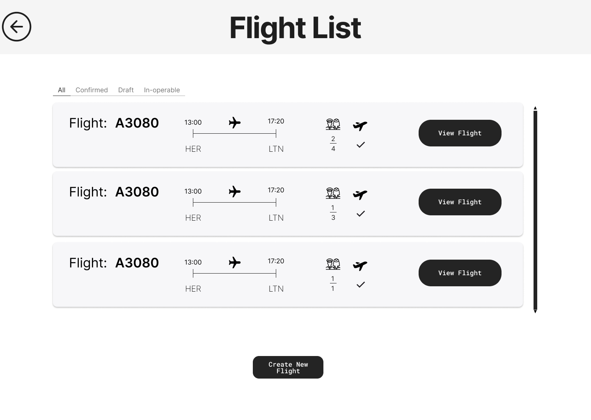
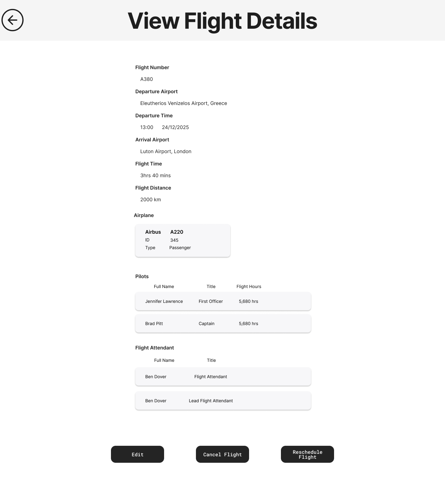
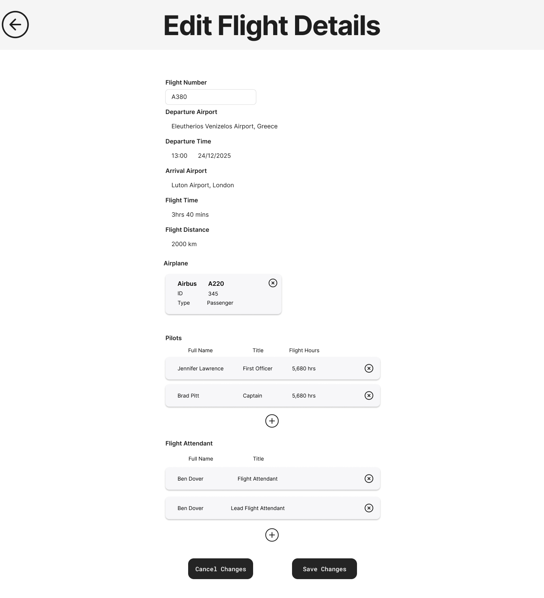
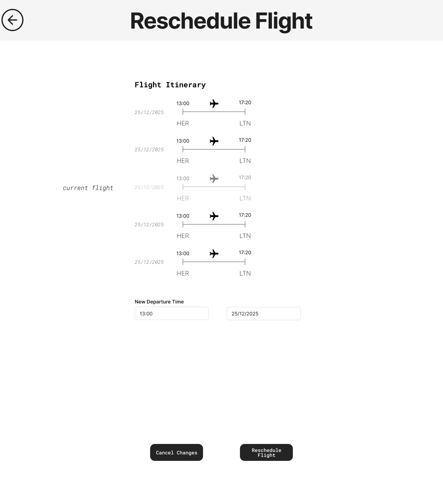

# SkyOps - Project Description v1.0

This document is a markdown version of this [file](https://github.com/ck100100/Airline-Route-Manager/blob/afa5fe0a39fce9c50a59dcadce4014bd6bcef5ca/documentation/iteration4/final/Project-description-v1.0.pdf) which has been translated into English.

Additional documentation of the code can be found [here](https://github.com/ck100100/Airline-Route-Manager/tree/afa5fe0a39fce9c50a59dcadce4014bd6bcef5ca/documentation/iteration4/final).

## Purpose of the Application
The purpose of the **SkyOps** system is to help airlines effectively manage their operations, including financial reporting, employee management, flight scheduling, and route optimization. The system is designed to simplify the complex processes required to manage an airline, ensuring cost efficiency, effective resource utilization, and the provision of high-quality services.

---

## Core Features

### 1. Flight Management
The system allows airline employees to manage all their flights:
1. Creation, rescheduling, and cancellation of flights. 
2. Feasibility checks using the entered data to avoid errors (e.g., checking if the airplane has enough time to service the flight based on its previous schedule).
3. Assignment of flight attendants, pilots, and food menus to flights.
4. Automatic calculation of key details such as flight duration and capacity.
5. Easy viewing of flights based on specific parameters.
6. Support for different flight types: passenger, cargo, or aircraft repositioning flights.

The following screen shows all the flights contained in the system, providing basic details so the user knows which flights have missing information or cannot be executed:

In the next screen, the administrator is presented with all the details of the recorded flight, while data such as flight time and distance between airports are automatically generated:

Here, the administrator is allowed to change details such as the crew, the airplane, and the flight number. Destination changes are not allowed (cancellation is required), as this constitutes a completely new flight:

The Reschedule screen allows changing the flight time, displaying the 2 previous and 2 next flights to avoid schedule conflicts:

### 2. Employee Management
The system offers the following tools:
1. **Employee types and responsibilities:** Information about pilots, flight attendants, ground staff, and their roles.
2. **Crew requirements:** Automatically determined by the system (taking holidays and rest periods into account).
3. **Employee search:** Easy search by the administrator via lists and filters.

Screen for viewing and searching employees using filters:

Details screen of the selected employee, where the user can update details, working hours, and status (active/inactive):

### 3. Airport Management
Management of data related to airports:
1. Data storage (location, capacity, operating hours, etc.).
2. List of all available company airports.
3. Ability to edit details and operational status.

View airport list:

Edit airport details and operational status:

### 4. Airplane Management
1. Information about the types, capabilities, and specifications of the airplanes.
2. Ability to change details and operational status.
3. Finding airplanes via a list using filters.

List and filtering of airplanes:

View and edit details of a selected airplane:

### 5. Reports
Storage and management of pilot reports:
1. Automatic cancellation of flights if the system deems aircraft maintenance necessary.
2. Manual review of reports by administrators and decision-making for canceling future flights due to maintenance.

Select an airplane to view reports:

Select a specific flight for the aircraft:

View pilot report and option to send the aircraft for maintenance:

### 6. Food and Menu Management
1. Creation and storage of menu options for different types of airplanes and flight durations.
2. Determination of menu prices based on the cost of the individual food items.

Insert a new food item:

Create a complete menu from available items:

### 7. Employee Shift Assignment
1. The system assigns employees to flights according to qualifications, availability, and rest regulations.
2. Schedules shifts and notifies employees.

### 8. Contractor Management
Storage and management of collaborations with external partners:
1. View all active collaborations.
2. System update after the completion of a task.

Insert job details (name, type, airport, date, description):

List of all jobs (active, paid, etc.) using filters:

Select to complete a registered job:

---

## System Benefits
* **Efficiency:** Optimized routes and resource allocation reduce operating costs.
* **Accuracy:** Automated calculations and reports ensure accurate data analysis.
* **Flexibility:** Easily adapts to different airline sizes and operational needs.
* **User-friendly:** The system features secure login and role-based access control, making it easy to use for everyone.

---

## System Requirements (Peripherals and Devices)
SkyOps is designed with minimal requirements to reduce unnecessary costs for companies (as they often use older equipment):
* A basic computer with **Java** installed.
* Keyboard and mouse.

---

## 🤝 Stakeholders
SkyOps is vital for organizing the resources of any airline:
* **Administrators:** Save time by having all information (flights, fleet, staff) centralized, while also avoiding scheduling errors.
* **Pilots & Mechanics:** Pilots log reports, creating a history for the aircraft. This helps mechanics identify problems early and ground dangerous aircraft. 
* **Scheduling Staff:** Can react immediately by canceling or modifying future flights if an aircraft is taken out of service.
* **Booking Staff & Passengers:** Ticket issuance is facilitated, and the passenger receives immediate electronic confirmation of their flight details.

---

## Tools Used
* **IntelliJ IDEA:** For developing the code in Java.
* **Lucidchart:** For designing the Class Diagram.
* **Visual Paradigm:** For creating the remaining UML diagrams.
* **Figma:** For designing all mockup screens (UI/UX).

---

## Conclusion
**SkyOps** is a powerful tool for airlines looking to optimize their operations, reduce costs, and improve service quality. By automating complex processes and providing detailed information, the system helps airlines remain competitive in a fast-paced industry.